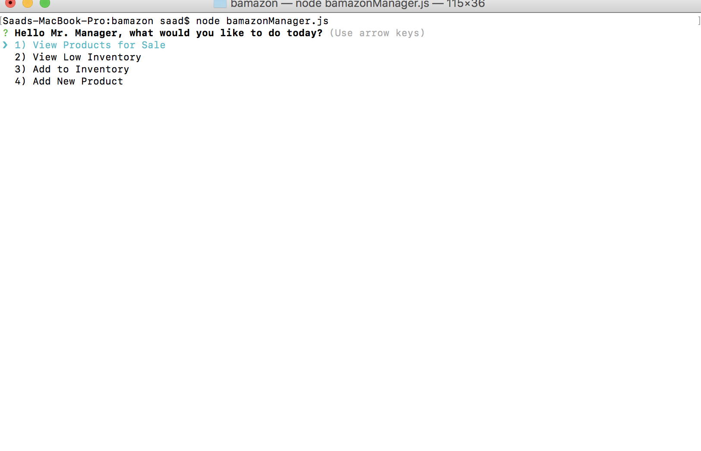

# bamazon

A Node.js based amazon-like storefront that uses MySQL to store information.

The application uses the **inquirer, mysql, and console.table** npm packages.

There are 2 ways to interact with the store: **1) Customer View** or **2) Manager View**.

## 1) bamazon Customer View

When the bamazonCustomer.js file is run, the products and their price appear in a table format.

The customer can then choose a product by item_id and choose how many they would like to buy.

The customer is then notified of the total cost, the stock of the item in the SQL database decreases by said amount.

## 2) bamazon Manager View

The manager can view all items, items with low inventory, can add stock to low inventory items, and can add brand new items.

Selecting **View Products for Sale** will display the the items in the store along with stock_quantity.

Selecting **View Low Inventory** will only display those items whose stock_quantity is less than 5.

Selecting **Add to Inventory** will list the products available in the store. 

Once a product has been a selected, manager will be prompted to enter how much stock they would like to add to that item. In the image below, Recliners are selected and their amount increased by 40.

FInally the manager can also **Add New Products**. Selecting this option will prompt the application to ask a few questions and then the store will be updated with that new item.

